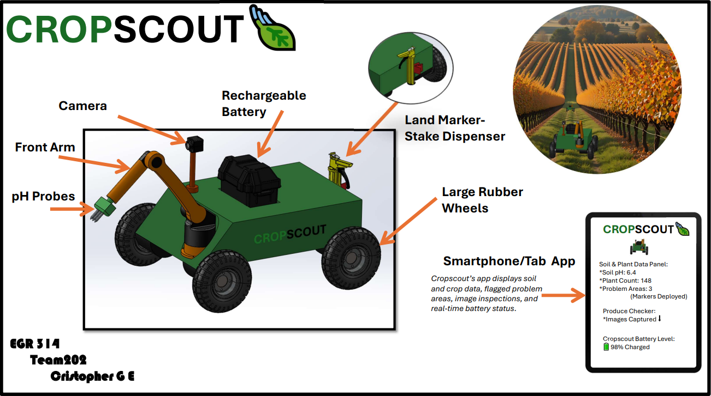
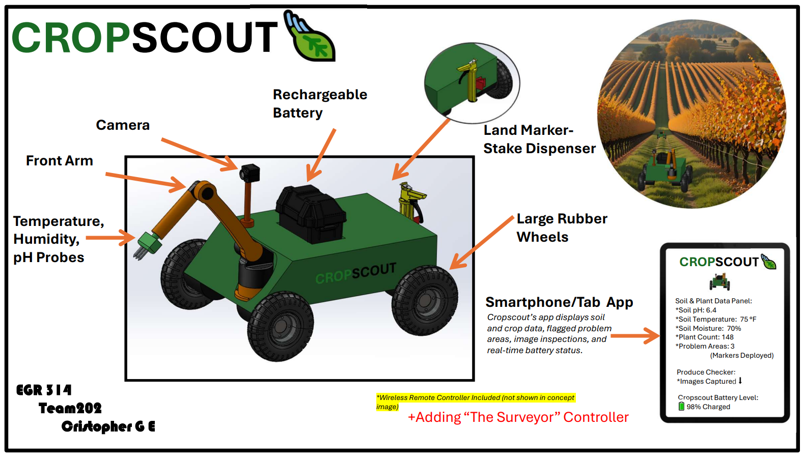

## Goal

The goal of our exploration device is to create a human-controlled, remote-operated ground robot designed for use in agricultural environments. The device allows an operator to move through fields from a distance while receiving real-time sensor feedback about the surrounding area. Instead of operating autonomously, the system keeps a person fully in control of all movement and actions, allowing the operator to make decisions based on live data and visual information. The device acts as an inspection and exploration tool that helps identify anomalies, obstacles, or irregular field conditions while demonstrating how embedded sensing, actuation, communication, and user interface subsystems work together in a practical application.

## Audience

The primary audience for this device is farmers and farm managers who need efficient ways to monitor crops and field conditions without manually walking large areas of land. By using a remotely operated exploration device, operators can inspect fields, check for damage, and identify potential issues while saving time and reducing physical labor. A secondary audience includes agricultural technology developers and researchers who are interested in testing remote control systems, sensor integration, and human-machine interfaces for precision agriculture. For these users, the device serves as a flexible and low-cost platform for experimenting with agricultural monitoring technologies.

## Exploration Device – 100 Ideas (Brainstorming)

Below is our initial brainstorming spreadsheet that lists potential features, sensors, mobility options, and system concepts considered for our exploration device.

## Sort, Rank, and Group

The listing below is of ideas sorted into 5 seperate groups:

The listing bleow is of the ideas in the groups ranked from most appealing/applicable to least appealing/applicable:

## Product Concept Designs

### Animated Exploration Rover
Animated exploration rover concept by Aaron Kiem

### The Surveyor

> Concept by Jacob Alger. View as a PDF [here](../02-Concept-Design/images/EGR314-Surveyor-Concept.pdf)
</b>

The Surveyor meets the user's needs by being a controllable exploration device capable of measuring and interacting with its surroundings. It is equipped with a microphone, a temperature sensor, a metal detector for analyzing an area, and robotic arms for manipulating materials for retrieval or movement. It comes with a controller that can be used to move the rover, read the sensors, and run checks on the device's functionality.

Functionality can be split into the following subsystems for our team to design:

- Temperature Sensor (Sensor)
- Microphone (Sensor)
- Metal Detector (Sensor)
- Wheels (Actuator)
- Arms (Actuator)
- Controller (Human Machine Interface)
- Communication Module (Two-way wireless communication)

This device would be designed with our users' understandability in mind. It would have to come with a manual, but most of the controller functionality will be intuitive for moving/turning the rover and for using the arms or sensors. We would design the use to be as comfortable as possible, but this would most likely require several rounds of user testing and design iteration to achieve peak comfort for the user.

### CropScout

> Concept by Cristopher G E. View as a PDF [here](../02-Concept-Design/images/Cropscout.pdf)
</b>

CropScout is a rugged, weather-resistant rover built to help monitor crops and assess field conditions. It gathers data on crops and their environment using a multi-purpose probe mounted on a movable front arm. This probe measures ambient temperature, humidity, and soil pH, with pH readings taken using a glass electrode and a custom analog signal-conditioning circuit.

An onboard camera allows CropScout to visually inspect crops, identify produce, and record field conditions as it moves through the field. The rover runs on a rechargeable battery and uses large rubber wheels, making it well-suited for uneven or soft agricultural terrain.

To help farm workers quickly identify problem areas, CropScout features a stake-dispensing mechanism that marks locations where potential crop issues are detected. These stakes can be deployed automatically based on sensor readings or manually through the user interface.

CropScout wirelessly connects to a user application that provides real-time access to crop and environmental data, captured images, and battery status. The application records inspection results, including the number of detected issues and their reason codes, so farm workers can review them later.

For on-site operation, CropScout features a local interface with pushbuttons and an OLED display. This interface allows users to view sensor readings, receive alerts when issues are detected, and manually control rover movement and system functions while in the field.

 These functions are arranged in the following subsystems for development:

- Land Marker- Stake Dispenser (Actuator) 
- Large Rubber Wheels (Actuator)
- Front Arm (Actuator)
- Temperature Probe (Sensor)
- Humidity Probe (Sensor)
- pH Probe (Sensor)
- Controller ( Human Machine Interface)
- Communication Module (Two-way wireless communication)

CropScout is built to be intuitive and easy to use, featuring clear icons, remote error alerts, and task-focused controls for quick, simple operation in the field. Its rugged, weather-resistant design provides durability and minimizes maintenance needs, making it reliable in tough agricultural conditions. With minimal training required, the user interface and straightforward documentation make it easy for anyone to get started.

### Field Defender

> Concept by Isaiah Johnston. View as a SVG [here](../02-Concept-Design/images/AGdrone.svg)
</b>

The Field Defender is made of a tough reinforced polymere designed to monitor and defend fields from rodents and fires. The Defender is equiped with a rotating turret contaning a fire extinguishing cannon and a .177 air powered pellet gun. Terrain maping is accomplished with 4 LiDAR cameras. The Defender has a retractable moisture sensor for routienly monitoring crops irrigation levels. Tank treads allow for zero point tunrning and mobilty through rough terrain. A camera, and thermal camera allow users to monitor activities day and night. The Defender can be piloted remotely using a PS2 controller and a display, or allow AI to run through user defined checks, routes and activities. The Defender is powered with a long lasting rechargable battery.

These subsystems are arranged in the following manner:

- Camera- Targeting system (pellet) (sensor)
- Thermal camerar- Targeting (extinguisher)(sensor)
- LiDAR- Terrain mapping (sensor)
- Tank Wheele- Locomotion (Actuator)
- Moisture sensor- Measure irrigation (sensor)
- Sensor retraction- Move moisture sensor up and down (actuator)
- Rechargeable battery- (power source)
- PS2 controller (human machine interface)
- Display- Displays data from the robot to the user via wifi (Two-way wireless comunication)

### Selected Concept: CropScout

We unanimously voted for the CropScout. There were many ideas across everyone’s concepts that we liked; however, we felt the CropScout was a well-rounded rover with conceivable ideas and helpful features that could make it a valuable tool for farmers. Adding the Surveyor’s remote-control feature would be a great addition to the CropScout concept. We discussed this over text by sharing our thoughts on all of the concepts that were presented.
