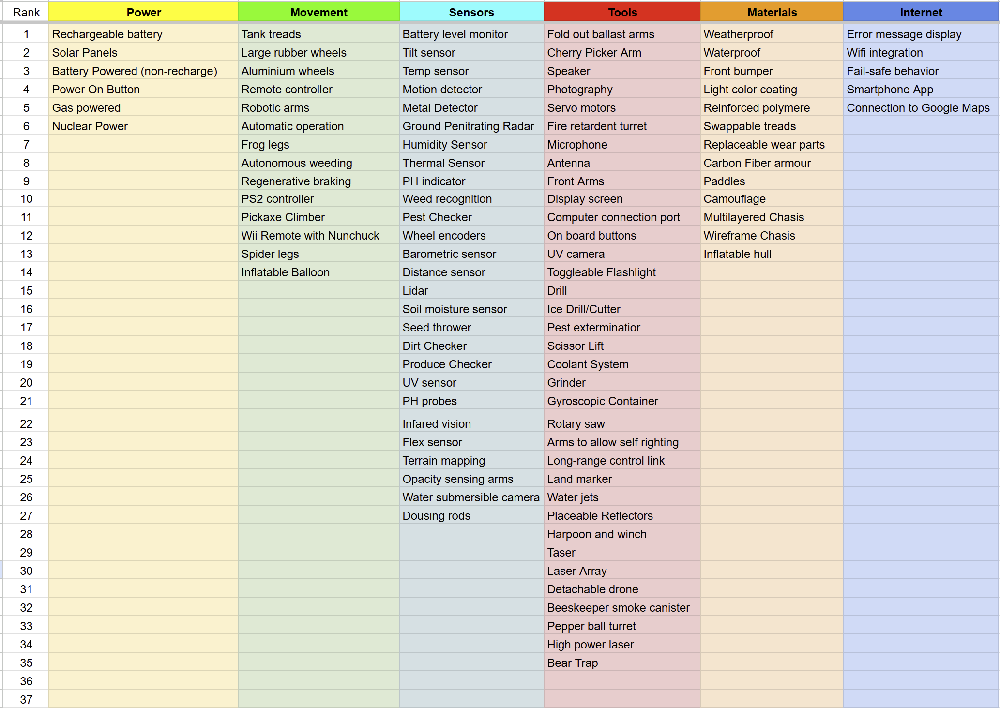
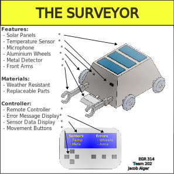

## Goal

The goal of our exploration device is to create a human-controlled, remote-operated ground robot designed for use in agricultural environments. The device allows an operator to move through fields from a distance while receiving real-time sensor feedback about the surrounding area. Instead of operating autonomously, the system keeps a person fully in control of all movement and actions, allowing the operator to make decisions based on live data and visual information. The device acts as an inspection and exploration tool that helps identify anomalies, obstacles, or irregular field conditions while demonstrating how embedded sensing, actuation, communication, and user interface subsystems work together in a practical application.

## Audience

The primary audience for this device is farmers and farm managers who need efficient ways to monitor crops and field conditions without manually walking large areas of land. By using a remotely operated exploration device, operators can inspect fields, check for damage, and identify potential issues while saving time and reducing physical labor. A secondary audience includes agricultural technology developers and researchers who are interested in testing remote control systems, sensor integration, and human-machine interfaces for precision agriculture. For these users, the device serves as a flexible and low-cost platform for experimenting with agricultural monitoring technologies.

## Exploration Device – 100 Ideas (Brainstorming)

Below is our initial brainstorming spreadsheet that lists potential features, sensors, mobility options, and system concepts considered for our exploration device.

## Sort, Rank, and Group

## Product Concept Designs

### Animated Exploration Rover
Animated exploration rover concept by Aaron Kiem

### The Surveyor

> Concept by Jacob Alger. View as a PDF [here](../02-Concept-Design/images/EGR314-Surveyor-Concept.pdf)
</b>

The Surveyor meets the user's needs by being a controllable exploration device capable of measuring and interacting with its surroundings. It is equipped with a microphone, a temperature sensor, a metal detector for analyzing an area, and robotic arms for manipulating materials for retrieval or movement. It comes with a controller that can be used to move the rover, read the sensors, and run checks on the device's functionality.

Functionality can be split into the following subsystems for our team to design:

- Temperature Sensor (Sensor)
- Microphone (Sensor)
- Metal Detector (Sensor)
- Wheels (Actuator)
- Arms (Actuator)
- Controller (Human Machine Interface)
- Communication Module (Two-way wireless communication)

This device would be designed with our users' understandability in mind. It would have to come with a manual, but most of the controller functionality will be intuitive for moving/turning the rover and for using the arms or sensors. We would design the use to be as comfortable as possible, but this would most likely require several rounds of user testing and design iteration to achieve peak comfort for the user.

## Selected Concept
(With a header, create a section that is a short summary of the decision-making process your team used to pick one of the team's design concepts and a image that shows this concept. Again, annotate the image to highlight all features included in the selected design concept. * Did you further combine good ideas from your design ideation? * Did you select the best? * How was the decision made?) <----- **Delete after**
