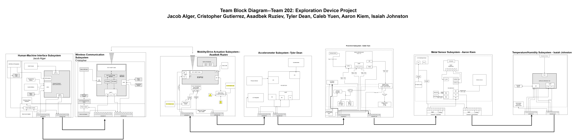
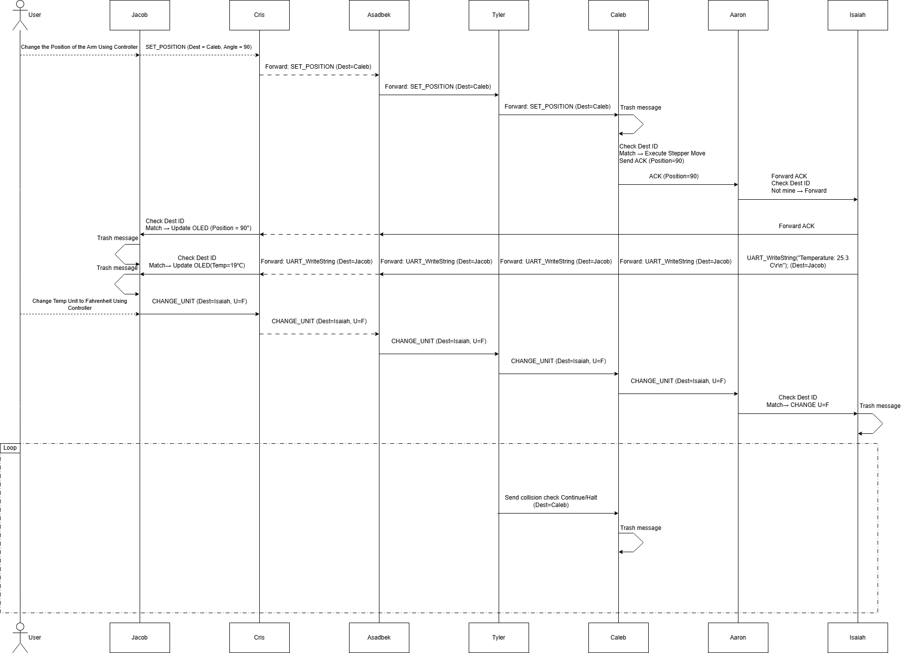

## Team Block Diagram

Below is the Block Diagram we created as a team. We followed the Daisy Chain format, using 8-pin ribbon connectors, to allow communication between all subsystems via UART and digital signals. There are two sections in our diagram: the rover section (on the right) and the controller section (on the left). It made sense to split the block diagrams this way, as the rover and the controller will be two separate modules that comprise the entire system. Both sections include Daisy Chain communications and will connect wirelessly using an MQTT server from Wi-Fi connection.

> You can view the Team Block Diagram as a PDF [here](TBDV3.draw.io.pdf) or via URL [here](https://viewer.diagrams.net/?tags=%7B%7D&lightbox=1&highlight=0000ff&edit=_blank&layers=1&nav=1&title=EGR314-Team-Block-Diagram&dark=auto#R%3Cmxfile%3E%3Cdiagram%20name%3D%22Page-1%22%20id%3D%22LJ8i2ejyHN55tyjF6ZPm%22%3E7V1ZU9vIFv41VCUP7up9eWRLIBMCA5kkMy%2B3BBjwxGDGNgnJr7%2FdsmRL3a3FsjYnkKqAZUmWT3%2Fn9NnPDtm%2Ff347DR7vTibXw%2FEOhtfPO%2BRgB2MEMRT6tzn0Y3GIK0kWR26no%2BvotNWBi9HPYXxtdPRpdD2cpU6cTybj%2BegxffBq8vAwvJqnjgXT6eR7%2BrSbyTj9qY%2FB7dA5cHEVjN2jn0fX87voKIJw9cbRcHR7F320ZNEb90F8cnRgdhdcT74nDpHDHbI%2FnUzmi7%2Fun%2FeHY0O%2BmC6L695kvLt8sOnwYV7mAvbHv0fsdv%2F57Dz453T%2F5ufx%2Fc3nASJp%2BgWX8ReH7v2jU2fzH%2FFJt9PJ0%2BMO2bsZjcf7k%2FFkqg8%2FTB70u3v3k2%2FRzaB%2BNR3ORj%2BTryfzYJ54rYEzTL4eXo%2BSL8eTq69D8z2QfpF%2BVPP24rm%2BBeOn6LmiA8PpfPicePaIMG%2BHk%2FvhfPpDn3KXWDoERfSlv69WmhMZHYxuNGDxgQjSA6RwhPIgAtvt8gNW66H%2FiJZkreXB7jLkL2RidfTiPFyHZDNE%2Bn43mg8vHoMr8%2B53za%2F62N38fhxR1bOEhn4jzQq749Htgz48nzy2vLBB9Mnj4c28tnUWSgFJnZWWEgIuU2uNIFA0tdgcNrbSpK2Vvg5md0ua306D65H%2BQGvpO2bo2Xw6%2BboUuHh5JH6k6%2BFN8DSeJxBypb%2FDcOoB7f3o%2BnocfqXJw%2FxNcD8am6U8Go6%2FDc150RvRxoNw9Nr9oHqwxyUDTLjYIwgQnsIe5QCJFPaQoICSxvDH2sJf9golQLeDySE3%2FzpBnrv8LiId5PUCYERxQJkDMMIFiFc4uhm29jEMKcC8MXjxtuDVB7S0JpWyWCYNV%2BSHF1%2FcQt%2FYkDtWvfl%2FT0Yl3UOrP%2FVft9Hv8JLLxIHg3tD%2F4XJmfhFAPul7IcB29a%2BL76P51d3o4Vb%2FfTb5rgmhjz09PurvGt1IY%2BnSvrk%2Btnik%2BHAFLmAcSCIFVFwIilQMvgRDIJbmBiNuuUAYK0U502zE0vs%2BUUApQRBDQkrMWWN8Il%2F45Nfjkz1tioam8bvg6qv%2BtXsdPJov3D0bUK3iwsS%2FdZjCKNJKMcgEQpQg2BxTRI81vHaM9QpcYu5yEb2cTOd3k9vJQzA%2BXB3dS%2FPR6pz3E2MBhTD5dzif%2F4hwFzzNJ2neGj6P5l%2FM5YY%2B0eu%2Fw9dYGxSL1wfPMSuZFz8SL86G05GmnGGI8Fj7pvQ8mN4Oc%2BlKoVdfcfGocR%2FMR9%2FS6%2BaDSHjp7nQa%2FEic8DgZPcxniTufmQMrhHLKU5CkyHKC2OdbSs%2B655PIHlzBefHEmU8HkJJa%2BaECMhm7vuLPJhRIITlXXHMqdPhnNnmaXg2jW1ostCTwBlxFPS6el62mD1vN9ehbLPcvNG2eZraeldgkEud6Ln9%2FeDDLOrnChkIx4FhBooEiIaeMeNwoFDCa%2BJdWswQTQHBEqGCKMIshiND6I6cUIcUIxE3tJnSTzaOyT20FkEzg9ZJNNuSGcXA5HO9prec2pFwJs%2Fev3fOPyAPlGmEsGYgAjDjSeHYdMrZ5QIQASkBBMMca%2FlCmtx2GGKAcIcmRVpR47F1sALu%2Ftz%2FYAcv5l0oAwBxobZgJ11GiVWbCpdIySJhNO%2B2TIwoBpBdbePdzpsWX0D%2FQiDkOm1OHab9cdSte7s5FjHot0j6PBm9GO1i%2FAU%2F%2B%2FPhR%2F9ofG6d7JexqSRSbaUkHH1UApcCq5VoKniaaQRoLVDFUq4n2cL1rgrcr2ZMAZRrBnccZC0zwaBG8ZlBS7uQElvzGRZHHShnjn0NMJeOYWo7dDNvC%2BRCp0aZ1sYW2hqUUa3zGwohszn6R9UKuea9AKbmDqssdG%2FwrL0TKB5Hrf7DYqXb2adtBgBUGmMNwu8aEpXdsrQICbQ5Qltqxs3gh91YCUSDIavOnubeiWl%2BUSp8W%2FaDy9ypwOWipr5UQzbdIqzeCUeR8YaOnCv2RghFuUbusVDCPz6nRk6QWOyIOVS1j5PoRoNahJA%2BVYStk2bhYwC9iIV8sPGgKL%2BQCkfFrIxkGEEC6PLKSD%2BGrH8lXBR7Khj2S32fD4Hl6eg5vj%2Ffm5Pl%2Fj0dTPECcdCFfGExrWbHDMIt1WOzL9p9fwN3607TAIpEEwvaWDzHQ4kkgoriRIhbjleVuRgSQgkAZxQTSpq7QxjOllOjbIy2c7Ihx09wde5wqMbNWs%2Bdp3kvbDNnJL%2BW9hz6LKi0ikmzddnqDR4NNOFoStIpDWoZkg%2Bjbm5juMhMrJ%2BbluU32%2BXFYzbnEvDFYRNvMBxP4%2BOy90eeR5vDhbGasqsn9%2FdODXpb5aPKwY4LNl7Mfs%2FnwPjOolht%2Fy3Kt1kGmjb%2F2%2FnQ0m08e71JRRN%2BXu5yW%2BRzE9edkPm0dPjcJXKuHqFXOSXwrBkQ658643mrIS%2FHuGqpWaeLj%2FfoljEeaRA8VKwlJH0Z%2FpEsaUrPH4MELzMulKjO4WpDI4HM%2BDR5m8TIZR0rivbFB2eA6mH59Nb29fKU3VA0GGP96vfht3sHGq2teJP94%2FdrLX4cXZwQPLkhO6GXxFUqLDd%2F3j0TY%2BenpyQCteetq8RuiJMKu31NqOx8v3Z4snQfAGAKM81jroFbYhkDNoFpfUKIuv6eXV7moVbFfuZiuxsFsNroKmTWYzt3Dmc6nlYWNSdLEBhDGr8uH%2BfWaX5lkKUdLpyqlpiMAuapBS%2F%2BdXGUav5KTGOGW7U6wNGF6xfyO%2B9JWcf6nmB2QafU%2F41PqU5y9zCNk48yTzSUrKLMUkAtA%2FPviFRENSLISyHa0kWgTTINIQsLlsnJgfS%2BOvo2iy1CXlZ1C9Y6gHyKW6py2itdl5cs2AbYGh%2BvvBfJs%2BBGl4ZcMpm4AcgFFHLHFadOCcAqUZJSYuj3KmnNVZmCcdIjxJVZFEqwoF6xJpcQsbNp3CAv540UrSUJTG79cYBoHFCSzsMlCdSIWwFV99YoBaPK1It3dYgDDZtrC5uYZEISiZQag28sAgpMkA2wR%2Fktk96KecQoDHNOVZp0GcaiqaEufQa7FvD6rOqfkfYqQgEuOjEtc%2F81aZpX2shZtx9PlZD6f3O84ma3D8GfHdnHpdwgnily3jO3G6%2FGij5wYf%2BroYaeK%2F6W4IEOfA7LTZzGVWmdaxY1hGqISYr0va3bAnEqCYFNe047SELcAc9m8UzMYUSX8YQ0fY1jSCIXSxZ8ESCb%2FiX4CsLVq%2BRcA%2BgGIOwKg4FppFst3cUf42yQM%2FYK%2FGvBHusEfgRRIpjiJ%2FnUl%2F1pLAX%2FBnx9%2FtCP8EQKgSVmM%2FvGO8NdaO4cX%2FPnxxzrCH0fARMxE%2FM%2FOqG0LgOIFgN0CkHcEQKkAhczuWNA6%2Flrr0%2FGCPz%2F%2BRDf4o0gYt%2FwSfnaCfVv42yRz7QV%2FNeBPdoQ%2FyoDgsuv9l7%2B4o3vkjp48Vasl3dQfnV%2BP0B4YX9zRv6c7ui%2F4e%2FFG%2F57eaKbfJ5hKIUyGkp2n1x7%2BXrzRv6c3mukN3GQ9KIbCit%2BOjGH%2B4o3%2BPb3RTFLApWSIhMXgHQVD%2BIsz%2Bvd0RnOEgb6SEMQY1HDrKBjMX3zRv6cvmlMEIMOIqkVjuK7k34sv%2Bvf0RWvFD2haKy4UopTIrszfF1%2F07%2BmL5kroOzAhOQx7GItu8Cc6aGSMLDQhC03IQhNKowkl0QQdNK3VztDflrPGLsZRh4KwFc5wevhtaDriLB47Y3yQA9BF28M3prerfmNvOjIFHxieBA%2FBrelgUQG9hACiMFbENJ8nSsZOkFQXVwqUwmLpH7TaeYZNXUlcGYPS6mNY1s6kSfnXcpbyxurakWgtltLLDsM9bMT98Yt%2B%2FefTUL%2BuAk1KACWCYqiMZCTMDatwCTBD0O6osASmBDyzPZzGOuDYOHwgVQTSGnp6ZuCytbDKCy7L4fK8W1yaDgccqVX%2FY7uYsHZg%2Fvff4dXf%2B59nf539JPIJnV0d%2F7gaxHb%2B1nT4y6onhzv59YLdlgbmxxo6H%2FyRVjYpX3Pwx5rnc1LQ10%2BgvPMLB4UIQCiLi9StTgyMA0WhvRusW95oj15IazsUac4XZPmDWm73IFoLof62e03WMMOyo0jenh2f1tiLinMgDZuZkWqQixjWyUJhBbggaNW7wUo%2BkSJVP283kDDDqaREyLSmamwv6mSWSH%2FnMXxsdR4D5QKwdMw9HMIgG1rs1sLsba6hPjIPRg%2BrNmSlJqCi7qWYA754xuS7p%2FvH6k4F6voRFAM47fkSHECrATjOaWuwEepaC66%2FoC4TdUk7zcHdXxemIWXL6MNq9ZNWhZcD6jdBonz38ejtOzo7Gt19vPp%2BdPnu52Q8EE31Kyoa8lHS5GinGwmGVs9vad%2BjrEqOoLDuRJUzg7k%2BzdsrXfjmSxp%2B29wzZd7il2rIdh3xq99Rkmi8RpPNfExXKhQf6PPAzZ5AG1mmp5AVe2E6N2quXY4X1c23iq2M1d8ZXCCWBFlK0xr4su%2FFVbsQq3cm8VoQ%2B10gtK5TECkBoEgoRmmESJzvwyu4XBSN9kD68txLCryASJZ6%2FPUHergPJqF1r4aZpcPuwy%2FMkqHGWh1XBTXpGrabOXMYFl3j6qKZVdxXxLixwxsJaT9iq5iP8wlelJCeKSHW1CS0srqrqCHW3Sh07tZ0a%2FdacTa7Cx7Nn%2FfPt9Pg8Q4EBnQzDL6b24cIPAhmd8NrnIbfpUZcKvARTOcx4LACJPWzwOTwMfbBMA9%2Bq0VM00gnnSC9RHtVVoEnECzJFMje28sMSEijWFTUNJTlzxggBLBMaDQtd5FvzGFVfWTINqkIYb4Htla0QAmWHIi1rpBo7Q9BVCBAZd41BSpH%2BM0SuFRWyL2qWep5MJuXmtY6fslwwfYG0hfBgWPzeDeGkov314sLKAzi0k47PL44GivSVtKKGW9Aakhb9QOtBpsu4Tn2fwZ3hXCL6VrhUAOc0j8Aw8sD297lnZRVQ0qncm0GqK7KOJeRvZcA6E5ugN2TFHQyuppO9FmxmHs0nWjqm1fnSj0EJbCrUICVzOaMoq8Poz0OLGxnlmleykN%2FfAZpeKmK7gJsBY4JaTdkEddpN7llx7Rqd8vuY6Z0bHz2ZHvFLxm2favmGM40gvCbvcnECIm9p%2Fl88jCrtlFibUMrSMLsH05ZXJmRnPBKAcvu5LbIDk9JJ6pvClnCRq7BksDnR%2F%2FM3r5BJ0O2J96LL0c%2Frz5slEPrDmGuc1R7pgbkjAsvO88byYx53m%2BmizvsTu93UpPL4SBnBHHZaeb%2Bqex1z1CG5WY3bzoTPZOG%2B8F4aL7p30%2FDhxciZRBpIzRVEU0ECESxZPH%2FjmQihAEzXwspBJFWtqwqXcLN1OqUaBpQCnhSNNWQ8e0VTbgLkzTKhrwO4yzR%2B%2BbFWTDXEs2IMP11ofTLpworhKNaqNSaKJheBWaFCKhkgCSqkiBpaAk66a3Y%2BhIwzxKI9BZNEJZAdLQKnXQYLL8KbTZmqGfFKXZXXCIOsL3ohAKSjqgQa81xQ2veSVe%2FkrVN27LM0sPYkjqMnfYLIGuBUVPbW73J337lHjrYaMOFX2ESd8J%2Fhtca%2B73jOAT8lNjU%2FK8UwyXIju0bdYomoVN8DYOsxDWq4Jp0TLaCU8tL1ho8sv3GMEoiGBRUMyQGdCO%2BDoi9UauSyMaqE2RjZCFb0UKU2tfwEsjGvOiaZpBdb4C1h8hOS2dUWjqjtHgGkMgG0b2IS3Ygt%2B0qMwpUAVAp2%2FgSWHgJt7SVCpew4gezu2BUuQQKkEw%2BS13eDMtGW2Bam9THPB3q8ljeYsf3weVwvFPRy2n73yPg6ZuzvR124Nd01%2FM1qQxXU1wS%2BwrRT68L%2FEyzx%2BDB%2B1l%2Bd1noZTOeotC5lvgjcrKlTw1sX93SZReeHH6dmygGYC65nzxMZgtzZfn%2B6uvC6OtC43weRCuxGz58MM3y3rFQepiU2pOJNkzMgcPw6DT0%2FsevYpixEGj6yIH52%2BDHJJ7o%2F94UnouW58Z4q3QbvLpNEs6eezkfk3iCxXou31mhWR9a4Nm8h8KXC0qa1xGqzcE0rs2bEbLNmytsmzdgeCwWrIuPZIb07CB8Z%2FVUC6wvn8r8Z1BoTlpg03nyxYLGJyzAoF%2Fthqca%2FMcfsDoxfHW7%2BPtgdKttzwWR34fWofnrQn%2BlxcH408OliR8hvjh5QphR4X%2BrmSdnn8yr%2FfDscF3h2ehhrUcOT%2FA8d7QUC3vaxc4SnastlxlZvzxzIBABCZT%2BWL1FROJ4MFu9cZu4l80H4cslMyQPplk0Os%2Fh5aV4W4iyNV3mXm0iugQCzm2LrEDdcDNeSd71k5ubMBZp%2BRNq2BGRZ%2BvrzIu03BSdLU9pmMO9YDo1ywnf6T1H%2FwpnayEK6OJN43T8EX4V824FZ5Bw05lsN7vtChKcR2pPA3FX1IKBgbfQwNiw5MRtbKGPvBmZxVkVx2RUEkSnrRyQhebJIouzfePb6nZfxpBGcn3j275GsBIGuyi6phntPwZ7L2TdwmPuCDoCSCjNnowM80eCE1mb58PbJw0jIwijGPnUEyDeNM3T4yNH1BaMbhyEwpaCX6jLGGTJdb2YDx%2FDvkPwZJJYr8TSvNoLZsPXWcvmnK7pb1JPIDF%2BiPq6%2FnmWmltLLSz25WLJvg2sLW1%2BE%2BwmJ7LKJlhyz1kwRAuZjP5PrzeNNcfp148lyw9bldQmipSSOpQIj0vOMltIgciuLwE6d1Xbn1qcIbULvV92VhfOcLWtxP%2FBVK%2FXNCfLK22eOnK%2Ftkd6dXF2PNjXJ08n4%2FHw%2BnXBIxRuSLE3EYXm2PILLv43G9VCs9GfWvqWjWo1vq1O2FudhHbxqxnw3Y5W00bk1O%2FQbk2MUkkTgjRsBxcfKLYCsUrZgclawExbsKQs9kSjfI3oym7H3cRfCUr7lDgtNs0oZgXXFFRuE9P9Mvsma9fkEMqJnVXnu1%2FTO1MnM9zWNDGG02%2Bm1g%2F5jIuLu8nT%2BHo4Xd%2FAQLJOAyOua0jmW1lCFwvHlOQCNmhidDIfrdraYt%2FaHo4vJ9%2F7uLBWHh2xhzY0uaqxo7ZMrHetYSRdR3sXu%2BpKn0OuarcMZ8GdQ7yjqW76Z0CNoZE5uFZ9gQdKazzIq1DbM7Fcakg%2BepgVxZkrInGpsKn0VmG6M5fV1vwbkN0yxyoJbS4ys1HpclR3VSCPHNxmgi9cE4%2BxUVwIUwIlhSZNGMg3jz%2B4n1xHds3DJPo%2B7v3Is37%2F7PPJThgMna1pa5UE5hbS5ZVfLoSU2v9tqWLDAy0klbG8gqu7EmZxjWKswOtum6dEZeYBN7Ch4hbs0R659fI9sSlTMtLlknbkwvjM9%2BlVDWmWNDtx7QXu1exQya0ZMKTYDpVW3mOla%2Fi6tiuEruWBBZBV%2B0lIpVxLBjv3a9h23aizQDlFYm29wU7NS2gga8v7cgW7cP1tYd2dKYrswbO7YDbMUzsydow13a6%2FC1lfrWE7lCFhhb2Yunsxt4xbiTHIlD8N7MY1xEV7MWSzqPCljo227Ia5Tu5fjX5auzJLlfDTElhwTdFeRyzDdg0nbW0b0yYVrC8bUyf%2BoJdtKnOb%2Bmv3%2FGNU59DHDUsgECfTrJpGIDtWs47DbLMNbJNY%2FwvzvzB%2Fr4jcK%2Bb3eI64BNxiftM%2FzOrb0x7zt5DbgFUnam6FqvA6tM611MrWPA8tlEh3u8yVKhiWJk8CHLnF0UX1Cskei0kTqbYihkWVUAcZLJaV43j0iq%2BRkLdSXIC3IIuArUoLYLJ0wNIB6tE3EVwl7ixTOzAC0hqHixv0ksRWcpMCqCN3SqXuI83nGK9fqGTFsMKcEKd7VnYtkXU5Qmtej9a5vjD5zb4baX3PJZv4AVuSQ0eT%2B9HDrbFCvo%2FmV3eVJA7xSRy7KMmuym2pM1vc7%2F4l92iZYxBMg%2FE4LN59FQXYs%2B2jkmhYlZ5ZTOfxZPY4z4eQBsBijOJHz3JWYLQyJWF2CybZ6KZOXcLkUrauIpHLyXw%2Bubck3w4mw%2FDH0cR3jA1GFLn2cVa02mG80CSb1KRzxQtTP9E9vvpGiF4DbVElcnoaftoTfeujpsf52VdqVpMaOdR8bpq4YnuISxoirj0hrz7iegoh%2Bkpc2hBxmxOyHh9CX4nLGiKubIq41KNP9ZW4vCHi5s6e3Yy6HrOzr9QVTVG3sS0tHo2%2BDdSVTVG3sT2N%2FgIWGLcbhTZpgdGyFhjdEgts8jSvtDKtmmC0rAm2KdV%2FCxOMljXBekDNrTPBaFkTrAfE3ToTjJY1wXpA3K0zwWhZE6wHxN06E4yVNcF6QNztM8FYWROsB9TdPhOMlTXBekDd7TPBWGstHP0hak8su9NhVocXZwQPPp%2Bfnp4MCD6IQ6VuI6yc%2FgyFncHiRvn%2BuQDhOYumXVVLwFvo4oWRi1pCLOOYCCfV1e7ihZsCdgv9K%2BPWK12lQIrmuzjXVeG1aTPmzbDQv4l9juBZ5LFXYEThcYUgiw%2BpdPgQyQb9VKyFAXpM9Ij5YCfMV2%2BuMd50ntNmkPF4Lprh0evRVCsBo4lhxu%2FD2dzHjedfKvGiJzfO7tdNFVlWhMTVH026jFlrDfTK0PVjY3RlnqqaRumqmhdxsbOlIxG3Uz7DuUfNljcel4idlidrZx8zt79ew9nH3OPh6ZuK8%2Fbs%2BLQS%2B%2FuKaostjcW44IbYn7cwIyZugPxS4OBnO7uJOi4Y%2Bt40C3ocVX1jwbAtZD0bsM2BnLg2BmuSA0kLHEi3hwObqXHcKWk7dNPBRcTuo8yt23MNK9rui68h%2Fnrt7DmvqN7rGYGt1FZyT75J30Ra2EWzNZHWqE0R72dNijTao06P%2BV6TmmyKqv2vykq%2BbsbMcXuUm%2BBFY6AZ2%2FgSUjxsmimRf0lDkqoFjyPZGtapivm6tIFuJsM7Fc0lAE42vqQET1DRDU%2FU0OxlC6C%2Bho88s41h9S2idZQTlPYerybhZkM2c3hu6UsoLUQ5iV3NWZcUudEIIkBQvecQxSm19hGJOeAWMUvPstGPBiDiGOqvJVD6KaG5L8FIEgUlpFb5cdM%2BgxYa9cTtiLaBlxtV1fimzXQ2U%2B436VPz0nfvpe9er4j8auHMN333orYSXTbd5ADylQiPQ3PJNnxmNhqmCFJE9RPHU8WW%2B4PeBKxtVRsyAMuVh6YpsRD7HF6UtGJT3zdSvlpmRckdo6MZ8pxZKp4s1Nec0e72JUXKF2fOuD9fKVtplct0vixxv%2Fr0q%2FOffP%2BfwfPpB3x4PL79dPGR%2FH07aK0nk7P1vj%2FU%2F8O9p%2Fl8Uq3LCGFAIckJQwJySGJjLinUqFGXBZKKUUxl3H4hLoOhPK3CMylBPBluEzH2sMt%2B3Ow9%2Frx8eL4ZiLfPT1dyd%2Bm67IDS5%2FpKDEN6d0RmMwEVKsSgQX2a5tS8Gd%2BashrI78V5rFxufeOrpfL2ZtW5yh28uMiOTigfmUMYSyIiXkxmTUpklVpaWdkgOH19LR2tlEDzk8f32rINvr5%2FM6H7%2BNN%2FA1oeBI3WTQutkLlTKbngwGYeaXf%2FQrKWUocP10enT4cn4ttRMAh%2BXKnTySSmTpIKeVSsnAYXzO7CczPCWvWQmFMBuJIMK4qQ4HFpYkrlZUBq0YOk3QwUSMKx5FARwbQubPv4gaR6CaP7aslVQy9q%2BmH35G6Cvs8P8e3FFzpn53%2B%2F8%2B3NTayHMUUiZRbxJpckRD10LIYMDqidnGXqHXLpm%2FAjeT%2Bg02KHSrkQyxflciEqp1P74U38kGnWdtDmLeACCcWlsHMOkNZ0or0pS21f7%2FKNwxZ5OGtaLniYPrOCalN%2FTOK9sREYg%2Btg%2BvXV9PbyFVyoMfGv14vf5p1wsHM41yDxx%2BvXXgfO0ZPWuUbzH6Gf62EW9pZu2OdCMFCESBMpCLcKV29WEBBtc0DK7R0IQ8ChRFRSYqNMUCAV5yrefJrae3A7IEt7LPCOU2V6yM2%2FknBcFCdekKg%2BEQ0%2B0BpXVFtBgGNmJyWlylKVsZYcjQJTAqBILvQyt8ooGxDpldRIMHHPptbTU8baldA4Ts303XimiARIk1DGnIadRZEUMMqxvSQYQEQ4hdwyR7TuB7DA0YLoW9Zgk3rXxDdlrJU1Od%2BFlUitbXWuab2UaR6dmgAKw70xYhF7rpMCphjAJnlrbIA9RVS93TvDzxjMFh9itsbH6UIZh847D5PpfTDOil1oMarWjzMUlnGXiIJ8HN4%2FDqfB%2FEk%2FuWfrbWhAdfHWq7ELNO%2Fbhh9B2rajkMRqXANGSJmyiI2sEOwp%2B1xFF1ZaewKtaWhXLsasMHmmpKmwbChTNDDaN2zKa08ksMBy%2FCkZvnut6kPs2TqMdSAQWQKPWzAqHxwQWtLyhGui5AfUFy3wrkPsvC3jQCspVuv0qnHNvWy5bSNXPUNYn4JCt07KBbFcVw4IgszV04je%2BgjiC51bf0JTLh9fDkTuStTbbKTMtrWow69NVhsnHI%2FJutr5U8MzGOASS2RpcEgLmtTxH8vjSqzcc0yqhhZLeFDfyGK5ClzFKuHCfZEa1ZfYlMYIaE3Z0dq0UaOWRDZ3bWrTFJ49sh1CVy3HrkjoLPW5dYLjprUU5ommraeldJo%2BlysPutFS1naEWpElFimOWToJJRIwSTxKCdO7akLcSmLhLy%2BtgikBEBRSOboUI0KjXWVJ8bKqFKdKP5zCrsOWSqK1uNWDWx%2FQsColylRnbsRiohkWa6aNUkkWixOct4PFqIRAMu4JFjCmQHwsk%2BGoxaBRukrZfCUKOGQiYczG9xHmqVbAt1zIZRmLIgEoFSiMkqY%2FADGgOLF3vwYyxn1R7I0N7Krssk3IRCyNLS5g7mLbQ8iKzidr3p%2Fi3PMLsG5%2FGwEtyJXGtF0HAhuzr73YxZWhupmae%2FH5%2BOP%2B0fGHt%2Frwp9P3H3ffHuq%2Fzg%2Ff%2FvV%2B9%2BPp%2BU5Dhl2BNZ6fhsGkNgvFyiivwcrzrsnG%2B3TdfrgKxR45WNsSecXXkydxlmIlcZIl7NYWJ0oCxaBEgtAQwti6rbb2EqHcxrbJL7ff%2FmX8kfz5997Z9dH0%2BPqfTycD5Jky0GokpGwzWJ7RC%2FbiYHfTOZ2p4G7xTAIr9ZEiCChP5DPVELTyL1XXCR8bL9X%2B%2B3aXisDml%2Bri683hxdHhM%2F5DjN89z7%2Fid6engxemWpepwjB8otsx7mbhuo4Lbx2LYd48i%2FkLKdaIQTWaxC1j4yCZ0iUtQcQtI36ApKohf9tLGY9imkvBxlsRddqovtKaCkYBU0JAQhGGgrghRCUoIMJpzx4bJZoJtAxTnEmhMK8jj8W7hB5DsZGlLsrV374VZhwDIRDkWCljgboLTBUQSlIelTOlM5gQ0Sq9oEIKJhFXKg4yxzq9KSlgkGGqtM4v43kXta%2F%2FGnMBy%2BKiRsmoMNCWO4ZUGCemimdEJjcTbd1jhk2gS2JtwZN0vbE29wAW2rgXXGrtgFntYQTCgBMhFNMMy1RjW42nICZvNWqfJeisRnIyoCnsevXX42w%2BHQb3r1tep9pJ7TFxuiX1dVxnV4GuBAItIChEWlJISBB1FQVEFGCEQMr1NsEJk1a%2BScYd6tem%2Bkb34CEYT26rkV1LBYgoJYwrxoj0%2BKWMeJZcaqJLBCmzpE64JmGbHYEZVVb0PVwTLdQJNsWsSpAacu%2B9tPbYIk2siUP6aqMxS4AdC6AgN45cqekrUJxeUDvlPK38W6FctW1yA8o9t0xYT1paK4StNgJzc8IaQRH2vNKmgNbiSWPyF5XV2OqmLO2IspIAgZRJ29Oam0SN0bWsMVw3XauNvtycrgghwDE3gQaKiN7kaoiH%2BSlb1vasm7LV5l7WQNkMVa1%2BynpqtFqhbLWZlzVQlgtAieKME4RUHXX0frq2ZMc5dK027bIGuobd07U00IqwwAqipjRVX2SqET9UlXR1jzN9PHoYDmJaLyZN6v2XeT3q5YdD1veZi7Yt8OL7aH51N3rQZhBcjLyssYgVQgAZjTwnjLlGEuIIIGEMHbUwlGxx2AsPGCrTuzcfi4kESv9HuKBtoaHD4jOT6Rt%2Bh0nZTMjam3fm0qpxSZDP81GDS9MMYC%2BYTk1zJPguuPpaIwMJDJgUhDDFJDQ4dxhIq7iSIai1sEVPLNeDzCWMPBBaxFueH1Nkzoi2OfTlWo1rTHSXNenqFt3L5letSO%2B%2BN6ZIzjD2FeX27flh2VHNo4cWWmwIIDBDBOEFOzqcSKHZybQVr6CkiguSZkUSNoDS1ijRutSywduyK5kEiFBKpURSKtEUI66%2Fb70wYpOMmPmgZZE%2FeZoXQ7%2BnHIHCPr96V8Oheie64YhI4fxVo5scIX0Hu%2F4iFdsM856l0tpAU%2FozLutsiKnUbnTTvPXqYPL94ReJb%2BKyPoj2yP2bRDh9XXY6pvxLjHOAywaeN10Vh%2FjbH%2BX0NTFqh3bVNswtinPism6M2kn7y0c6cVmHQ%2B2k%2FcVDnaSsWlw7YX%2F5WCcpa5vXTtpfPthJcFek%2FcWjnaRMwWo%2BpYsCIzE6W%2B50XTTHtkJHGP%2B6N9yBmpj8csyFVq8l4zjtdhwwBARncDVzg1qQyCtdHVCGAWKSY0H1PaSl3pubE2RMXSEQZ4SKxqbN%2BLHZlhXsMP0vH4onbYXiHdKeHe8j%2BYaKP%2BNctjWJrKEKsOupRJICnjZeCefACjcT0lQ1FSlrodZO0Ppc0csbPV3Ghx4fk17o1XH96vyQZHqoqzDPhoODFquNBFlEZ7Sal155qgU9glxiirS2IpsyCeOn6qk3GmkBJLVCAXHk6sxgpMV2QBTWsmwdMiNMAF%2FeHFPaVAYBKZ287Ta43bD7yYfdM08Wwdl0cjsN7u%2FrTb8xy4UlNMk1ikFfj9KM5aqf4KWTuusmeOsuuNiNxAAVkd9Ta%2BAwPYpMCQCpKe2MPqUpo5KWTvmum%2B7VJEwNPiYCiL6SUCkYwwSTbuheOiW8brp35duTSCtWXFGKNdYZJB3hvaylXzvdu3L8IagAUoQxwilHYtmlu23Cl84nr5vwnTkGiekmqo0soi9nZt5KN4QvnXBeN%2BH3VyH0RjR2BYE2aenyh6flPNSapKb%2BUp9Pq5KDsGM3JVBfp29iOlE2tQCdGcPH%2BxdnB7sfGyJ%2FwaRVyc2UIYYj1w%2B0Iu4tGUy0M8PZEH%2F%2F%2FR%2B9JL7EQHChIMQcU95YAJM2nxZP3TKZVry%2F80U3xOWLcjMLF89amE6%2FAG3brmBmZdjhgraGyy7YFc%2BnsOB8hvLO39l0nKGf9LJ5yOJOILtJ%2F%2ByGYM66gDm1YSvzW82zWDxWPJ9ESU9lYW6d3xDMVeMwjz06HUlm2AhkyaaSebO%2BNLDxVfONwuhNmVlcJtSTMjO2NvVXRC3QJguaub97MpPsKqmWWGuGSaMHO6olkwBCJhQTTNuu6ZR80yRbcRil6%2BtbpEWXsanCOk4kwyBAU72wGG6eETwds7desVyE79vecaXVa5rBVBZB4Y5onV%2BQdcC04S%2BRtmsI5aZ4JG32M2L6XAsiGDGBj1gXaynlgG3aKi8GvoXK98HlcJxGUhAlfl%2FpG2pRkVNxlWyUaLAULae%2BOdvbYQc%2B%2BXMQZ%2Bu%2FOQumwXhsSludkNWrRQG5qXQy7eEeRw%2BvN4xdeWEaXQLNKMKcNCY%2FWCyfkHX95OZmNmwGCGWdcm1UKBdG%2BBPlbqaSzbCnWdXV72Q55k1wPxr%2FWJy9Ox1Fg2CdUk0aZQlAvejzQYTW3fDjg2lUZuevxssupvOmHZwMQ6TCWUuj1hHhAC%2B7Qfp7GgggoH5kjigxtW9p540gEBivTJyRlRaGZqj3otQ7bGlA6hgO64doZ0X057u4EuXryfHI9Joxrd1AGN%2BbNtZOlzev5fNuXBAFOZNd6CbITGzXrLQsQU0zG6VaW161P0BrTZMzcoAzqa%2BmDCv3zkQKpt%2BH3Ax%2FblUPiSeX%2FYIQm1cbF10CmiX0a9E%2FCGvQAr1JUKYIEkxGCmSW6o0ENYEDurD9iJKi%2FM2a8VTFOPqNjGyElbZRIt3ArKgVvdHbFJNazaBSS5Xmcvd5ZzrqxdlxJwpAGDbjiezDNPqpZICJVbocbojwvmlIZQlvtOmqhqBvmQqnCq43MYQUJQdf2gcy75yt6V9Emj68eLqc%2FZjNh%2Ff674E%2BK7g3X%2BnhcvaYVvnTE0qWh51n2eThdoPpxFhXf4zM46z90c6pFdiDMyBca0RZk6QGiAFSg8v0%2FCff%2F2fwfPoBHx6Pbz9dfCR%2F3w54Z7kQ57sVE7DqMSqWP5ZrS%2B8DdVS1eYkd7xv1aHn%2Bj4DbpOWV1OLwpmrcZqu2QSp%2FN%2FPla9l11fInvekyggGlK%2F6pQdvxk72tzleuZOqS7M6IrOV8ZwkIWy1KDdmJfrLTOmVUXh%2F%2Bfoio9eel5qC1bUsTWwOmuCrI4EEy7%2FyNDUbvVHZPIYkb03bV5Nl8Ovk6tCZKeYZM1alOG40uQpDW%2BSv0vsvVo9c6f2MF%2FuPQWMvB%2FGk61Mt29KTJMJr%2FcJVweDwLRsGd%2FuPd5O5hNp8sWzN6exuvoR%2Bv0QbZDkaYQYa5PZc3vUcNcYXYLZzs7RpPFl2KdGLr8lIa59DmwtvLanGyXOfTDz20WQ5pXqaDm0Z3wiIPIgTUoH77qeORRLlkbLepnemJWoHUNIfUtZOQeYDUCAkdSlWrCsQucXBjtPEoSu3QphqP5tDmuWlSeXzI7ZCqWrFdMaloY6TylGm1Q6pq7pliUjUnnDz%2B8XZIVa2irZhUsjFSedx%2B7ZCqWuuqYlIh2BitPN7%2FdmhVrRdVCVo1J9g9zSfboVW1Fj4laFWHZH%2F%2FcPD1%2BMfhxY%2FR8D%2Fy4%2FKfD19%2FvBuU6cRVlnYtOFAW9vjniFALH8oyRn81Dmaz0dVOMkxveV0wUym%2Fi0ndKfC9hK%2FOhtORJrgx7TtLShlwu%2FQpv4TEOR8JknuBVQJjnV6Q12I%2BzbQMt32D8bMK26JaeOicZBb3qSSQUMk4WIKssLcCSnFmjTqvP2HGL2i2ydLFTkSvSTOXlTVzWSdmbjgAoe92Li9r525KQ4dU%2Fbdzedl9qnbabJ2d68uVaodUW2fn8rJ2bu2k2jo715cH1g6pts7O9aW3tEOq7bNzeVk7t3ZabZ%2Bdy8vaubXTqtd27ts38st8cvfX7s3T8%2BDP%2F%2BjRH%2F97isP9%2BRp57TVUJ5OFunkw1VbhtERUcnHo%2BM0XhSG6eLv718kuajZaiOwlQI6dYOY9xqMRal8Y33T5LYjMy%2FDNuTb3J%2BYmKjcPtmTAWfpixcuiSlPO9uqv3fOPUWXbTlg8OVu8uhxdj6bauBkZb8qmBZUFPIuQpWJwBjCzMEMb42TfcPe6WTkacowAM%2BvimXUML54eH8c%2FqpRN2hkCGMiM5IndM04wJJ%2F%2FMhUkTRcolhANUhBg1fbrhY7Ni%2FoXuoxvspPGFJYcCGtTXSdkeDjhhqxDPPhgshySFibSzIZhde1aWSpZd%2FaImxzZUtIfGvsLw7LJdFXSskN8%2BVJtYYkZtzjbuUQp89GOxGKeXa60jxLae6YpC7XvVp830s8vHjNjC3bSrc9xO5lcjsZhVtubUM%2FT5%2B5ezZ8WqkEi021g2HN3FlxfDr%2Fqv86ffo6G32pIaqvixiS%2Bmg%2FG0vJeURvVsg4b2Q%2FeMh3WYjQncnu9N%2Bto%2BEvUS80ElchOYrwLYNq4LNVRbc3KhZIbj%2FksXwArnVGcbTa1HehCdncDLdpYfk4xwg5WrUsKwlf6M50bqOobAkoEvBJ7Am17TyinMq2lLKdDsNjaK3YwOeTmn0%2BoH16cmZla8PPoZqR%2FnUyun%2FQjVBFgSxsk6UugtvhS1gJI2KAhi1uwSzz2xkJFM%2FqZXcgI7UNvz45PTRVpSS%2BEuXOZ2%2BpD4Z1FnRuUzxpRII5QL92QGAINhYwyugESpMkF97gqu%2BOtHFO0rIaDaYaGE%2FFtkaaycY8c4a46tXQSwW0xzbUy09ga%2B6YrNsXUmR6DdRoeaZbwNzw6MO8q49XYC6ZT05oLvtP3zXQsVFg%2Fz%2FLZLoSlirlcPsxRg8vniee1IJOzKJwvb3evg8f5ykvsLXzZlMXYitiplvkFPNbsIpUp9iur%2BpNOHEI75bTpBRzbVqeFoxrHgcEs7bXwio1r9OS7j0dv39HZ0eju49X3o8t3PyfjZe1m%2Fxx%2B7vqen8%2Ffkof%2Fnf7ge3eHby6%2F%2FCUevkctOlpfX8f5xHF%2Bop97RZzElGnPLCedZF1SYF959m1MzKgrLqnW4xi23cgZllZdhlHch7oWoRMPU%2BmomDh0peKU4wBIKgucB5l5rb11CyBmY5DQIti6l0Q%2B5pJuAejuhbS0W6AusNIyLTs6EYz1FbQ3h7MyziLM21%2FUUikJBdpoMHscXpmLb0bPZh0bti7inq6b%2BtJVhqF5HmqqGN4v8iaKDM7N579ynzqcOLpEDEbAmjrqB00Vrfjn4OhpgO4%2B%2FsGm3%2B5vD%2B6%2BCHg4WGOka9ep5UhalQNaOYj9c7XTZY2U%2Bzy6OsRyXC3D8GfHjo%2FpdwgnimQwW02%2BrjrSNr1f35OWn0fm2rPyayByn%2FP4vbT0pTg1QfQaaNurxH8%2FMT2qT0%2BJWU0ctFMp4Kct3hra9rm0wE9bjyuyp7Ttcy2Cn7aeWoSe0rbPxQt%2B2nqyinpK215XO%2FiJ6wkh9pS4vS6P8BPXUx7RU%2BL2up7CT9wtKn1GHn93Y%2FYpKmthoS0xsXrWEcxLy9LW%2F6ZE%2Fy1MLJ93ua%2FU3DobK37ibSDu1hlZuKyR1QPibp2VhctaWT0g7taZWbismdUD4m6fneVL1ewrdbfP0MJlDa0eULfXltbV7bv5%2B%2BunRygPzwdCDA%2BD0%2BnSAdO%2F4H9YZxJXcZEdO33ZnHI%2F%2BRaZhuForcRM2cWorXkwT7y%2BHo6HydfD61Hy5Xhy9XX5vGnDMyMzs4MkFS4oMP3IJIUIKWUNUJAYwMRPFMzInrvGMKBmwiClBDO7n1vuzYoSW7hgAEFKMRMCEmgFtxERINHKTcVtOerPjfB2JSwziNCTnOUXOl2wRlwLFqXFRJVg8Tv%2BKrBNexuunYDTOm8oO%2Ftbifz8LTMpM%2FeKApSbj0xfjyCRVTsRuk%2BDIEOAWbxRX0mXlzdwf7eDKvitwChdYJc4CbBK5AtvouyKQuuKAuy6n%2BhFW1nwuo%2BDoG3NNIzcinn%2B3lTr2BjtLN1RrCVuc3nDO1t2jdre5AOVZqB09qW3bVQn04SknXAb15xnjhMidsOi9a9AMOprUrLXrXKygqFtu5blS4alO4FE2NZEfZzpL1yINpWtiOYg5JQi1GHa%2BglDyhMml7K%2FQb6h%2F%2Ft7nIa5lO57OKxvGYd%2BYnq8iY1Q%2FVeLh%2BWUdW0HNauJhHbiYX6aeZyHfSVun%2BNhfpp5akz6Stw%2Bx8P8NPNkevSVuH2Oh%2Fntu9IKVvfE7XU8zE9dj%2BXdV%2Br2Oh7mpy7eHur2Oh7mp%2B4aJlnXtqrbSAEhx%2F1cH2XK2lp4S2ytnqUe%2BmlZ1tTalOi%2FhanlS9ToKzW3ztTy5Wn0lbhbZ2rhsqZWD4i7daYWLmtq9YC4W2dqkbKmVg%2BIu32mlq%2BDYF%2Bpu32mFilravWAuttnapVrn9i7jvJyJzWbBfoWo3p%2F%2BbI9bhDOaHKT36je345nbAAxuA6mX19pjN2EP4uWPN%2BC6avB4HYYvhldEr6hz0OmrTV%2B7e%2FZ82Eyj5700dhZpnduPN0kt%2Fd8meavVWlbfmhKRFvYGrnWHS%2BwICpePM%2BiSXMuWRsa6%2BKb3yPS8kNhx0lBm3NSVO32mRtd7n9yZ9U8zUpJdQuiJPN7ckpVW88CdXIyi7JAkbDzddbLAlVOeyoIBZAy%2FcVKt%2FYXggEo7TsilUqYttqC1Ze%2Fw%2F7494jd7j%2BfnQf%2FnO7f%2FDy%2Bv%2Fk8QHKdIoEEVx0dfJ%2Bfffg6%2B3vvcu%2F68MedvEGPAxybWz3KH60nR67fOaYDxS1YKZXPGXVcISLuyEwchbnnF6bKubl2xNJXS6ewuneSgCZ4ztqzGme6dQaUFTId6R%2FTbXvS9kBgq2ejgvmdrwfYbhVhXVEEd0FhuijHhizWkK2Ywu0%2BnK%2BaoT7Uf58Ng%2Bfp6Tm8Pd6bk%2Bf%2FPR5N9ResVo42uwsezZ%2F3z7faersDgYHYDIPv5j4h3g6C2d3wGqfheamBF0X4lgJ%2FOR5DAZL64eEZw8e4JI05DFJ90FKSS4jfoCxSxZc%2BJi%2Fokwp6njPKDw2pbKDJqlLWvRWnuMG5ReSUn%2B3%2Bb%2F7m38fJ2%2FvbD%2F%2BMHr6zZcvEdUWrF7K4o3lgMdhQCmqJyoHSzZG9NBIbitSyZlw%2BTWscrZHp%2FUm6jq6HN8FTaB23WVvqVramfVyrp3J8WsZ18Sa4H43N8h4Nx9%2BG5kumPVYIR6%2Fd%2B42Dy%2BF4b%2BnlcE9wJNHn0eDNaAcb78jJnx%2FNcKj98Wj4UC1tmSjAXQFFV4Ngl2UbZFmalBAcCNiWUBUEDgfnP6fo%2BvTfu%2Fu94X9n5Pr45nbQ2%2Bmwq00mzfeUFhn7m7Tkx93MnhCO74jkGyDC0eLXv4JFNkzJ0RPuM9rxiPrKmb2DTWodcOMGMtotfMNr%2Ba%2F8psLSOihZnualapwi0FbBf7bG5DhQMUelAOa6qpwiTcIsP1V9mlceVZucmPXu6f7RhBmquLOFsxlZA%2BKkIy1IHdFH%2F8AiUY2xvTdjHfP1hvM7vN9p0%2FkdG61OqXHY3SEZxYZ7EssIRO6GHIGwurJ2ktWJ55d9KpYSvdmnnPYVBFcMgth9bQaI2k6Lhvep%2Bs1PZ5k%2BVcw%2F9sRcrdHEUtlcTSFuiKdLjRnakFBVi2KLKaWc7bw5SnmSDOum1MXZcSVCMXevsAiFkGPmMFFLGN9Lq6oOutxy5c72CqV42lbnlDRoq3c0Pg87fROKxucRT2rI2pcQmmOtV9gOckcwvkxTW93n%2FfAmMUwN4uIkro0HqnlKb2w5BZ29T5u4zckp3LxQ%2F%2BuiYm4W8ZgAxWLdDDxvjFwVXVX%2Bm3VrAlhhl%2FWjLjmA6sqm9U0RakDMnYyuphN9qCqypSsGpIVr7EyCFw3iOu5f%2BWuoK024aliXsBbrNPxMUN3JD0vQK01wz05eqHOXDNezHPeiX0mizhYoS0YkXH2LOvqWc6%2BGLXGBf6vFK0PxDVYPipZXb50df%2FtXz2U9h%2BBlF68EFze9di24uGu1eBDEfpPnwLyrPun%2F9oKpXnX9xzt93zpNE%2BHqJMs48NJ4dRLsqGzONhEVlZJcLPTHh0IEL1BNuvShbLZyFQMluR0ktqSVrbs%2B2eGf1tNRHKMCFfSClVzkX7Gxu0oJND95fE8IC76%2BfzOh%2B%2FjTf3FT%2Bs572EiPw0baLgjm%2BOBVc%2BPzXALkEbByOW8i985IKU9xaj0EFowCyaQiFHGFRVx05CN3RF3JAKIIciYJFHpTlA1R2uMYa4LSDhnPjveRfIPFnzGG1s1INEFy%2FaRCckmI9ERGiBRAE1uTb%2FG%2FSMFZ7%2FGAcg1qGf2f9orrNQKYUhavQUPU9%2FhxWqH%2BsdHDqggKAYSgWFEuoCYccfNwEFZgRXPzf4rsjBOQeM8qoMMSAikSn9AQ2T1Rgl%2Bb7FhJIJNwT293hBKAlKAKI64ZQzUF91jG5SpMuStRNOalGyUqyhqJ%2F14ovjhOISkqBU7ry3h9D3U2xlvQjPOWof1dZTqczZ6mQ330YvgwMwGvCuyGIAMEK80nHDKIGPfkviuSZqh0HjxZJme1zGGefJhWCL97dTUcD6eThQnXGNHNUC2yons6SY7RtAwkqRVASN%2BfaWpIyDjFnDSlUZGWdhe7TmZupFVBi5OF48TqQ7Fpc4kyK8c1QyQWLlbXYh8a4SDBShynVo5hpnUGCTGDQhLemCpMupJa518q0Z1hwDllK9I4ZOeaX5J0RetQXWvAlGAOkZTQKGVN6QS4aZ2AdFP351UKRFmlYL3K1JI6AcpAVbPuGBbjLkKWQAWtBiyP%2BtrnFzQ%2FIFYjEOv8jV09uSBsWrhcj6bDq6jlleYMIwlcgfOxKYFDZdqoXmeDbk3glIkybyRwOio4rJC7XjlRvqTAIW3lE%2FhXukxx6EYr3enOUrHxlJRWhAaSmrJcsx2MnSGgK08PAcSEMc%2BHt0%2F6e3Zmh2bI41jiaoGOICSIUKE4bswiomWahWwmcWF%2FGLGsxE0zYV1en07dPrRMKPu3W%2BhmVHnY6UJ7yolKylW3T6xPttbfO7YwG2m9bHsCK%2FV1dc%2B3PGfw4uly9mM2H97rvwcf9fXm4MEwTHsp35C1qnbvbDDcDgNbUeA6qqr9LuTGlTfaSau1SqN6mxYm3Sppnoq7ksJkXbXs4LQSawhtHiFFCROEcxGnKSe4RHGgUuG3FM8UxJoZRxoLjMYJAjWoYV7ylSps7F0b7zAxI1Ncr99cuqxcXndD4FkbwsdhYGR52FvKiPJRcDsN7geD6PiyO%2FTh86Om56JduZH430ZXJo51Np38a%2Bo0Cqu2fJtCLe24W6fYu%2BBqYj50d3xrdj%2BTFLo%2FHc3mk8e7cDd8%2BzQfDafT4c%2FFe7uz4PpyaGh7%2FvRzNPy2OJreOsN7BOOhue3fT8PoyG4wDYn9x8hst%2BbI8SwYBXf6j3eTuwf9iWbXDe4NQB8uZ495O275dagggAhxE7SEPWZsgJiduKo39Rr25%2By%2Bc7UmHfv7u2VKkfYbv%2FWxzZuJ5SFPjK%2FW%2BN6qf1tyz0ujT3A7PbCuvm9e%2BNXfz8CzpflDrG0Cz1nvirFCrBUUwpnwNJvhgHCpKEKCU2H1ndGLCiCklBLJIOZxlchqiU33VUyoJFJAxevw2XtXu%2F6eDNux2hUDNYQC6jIsQ8ujy0TpsF29Xlgi9OrZ%2FfE1XAAjCEmOKGdc4s1X9%2BLrzeHF0eEz%2FkOM3z3Pv%2BJ3p6exXr9uGj39sHtyN0Hf54f49uILnbPzv98NGHaNOl8r68w6pTp9PetHUbz0Kds6qJHaqbWjvdAK9w6W9TRZAVmGMM6%2FZCe%2FtyODTnk8rtr4mCGnGM8ZulZfQZd3vXGd%2FOCpvt92fogHlG0JPzijD3BBNQpDzsBgnFeO8qvzg6zGD19uv%2F3L%2BCP58%2B%2B9s%2Buj6fH1P59OBsgTsq2BH9py33l5PM7c2hKGQI6lEH9IJgaJU3tkXVLEEEgYRdXeZOxJpaV5AmPP7ahdDtUwW6g62cKTOL%2F1bFG2NXBP2MLdJwomYjHiFDritUZibe8%2Bcf7j4r06e%2Fs5%2BEA%2Bvv%2F58eLgf%2FffovTGps3E63BCyY5vIgBu2V7UR%2BbB6MFKydm0WBFxBbADeB4DY%2BltdHv3OOCpYiJ65yIhVn9H6hLVn9u%2FmEL6FlMSAZi1nNTZY2WekCs9%2FtHHqQ0s5m%2FIqBgRgNytCUmbU6nTPlrw1aUNMGupNowv61ukixAGoJJMaYIqrJhb9skRBxRybPOy0U8pI26vz8W6Yy44ZJzUkfHnR8Ba%2FYSKh%2BJ1k%2FVVtTdGFZdJ%2B27mpP7sX0TZSbmIGWdne6KLhsPoaxztudI1ke%2By5Jg%2FkzwLKBEsa86f1scBl2TJxFZBe%2BmRfwhSCjgRTutejkCCm%2B2e2PXp2xlcXuu8WdJN2UTVEohSod5Yz6wQ6rVlQA1SpQspoo3zjqQIWluKKMenU%2BESHOXgZ16yLG3KuqRI7CiKgFBcxnKnHqlTl1TAsbZT0xRq2rFUWMs11Z1QWCObtA9SgXajWwjCAcHS%2BC68rKOPA5LQuUUhKwOqDa4sTsy9XRGbc6H3fFlZuahv8384Qe9Pkfz2z82XLzd%2Ffj1S8N%2FA16JrQxOvlwld2dNIN8v0StqzO5gccvPPsWNL2pZO9teFptXTLCd3MSsxNBoZcHgwqzGBjGLAsYJEW7QScm2XRkhNtT8DjCb%2B2QYtYhIIe6clXII41XoTE9aL7zoNWCS72cSWmwPEPKkzAl4yMLPcCssVqZmbFJeJZouTDbaDjdwVOJ5r3eAY48vJfD65dzl%2FGP44Ikm%2FQzhR5LpvnqzoknCWSMXJWNqWXfm0BOVuUiLiFCyt3YQRrADnC83X3gtNqawUBBNFCec1CIV8T1RDns0txAOqBAFsZsmHi0%2BFNOvmbglYyxu6WupeoaDZQOMWoqBiAGMDFGAFkBkj5HGK1Y4C745Vr%2B8Ld6sgVMjtG2i1AlkKgtQrWEsriTw1qnWjUSlpQYxEame2WygOgWVdsnGXoXwcvUimZSeO1iUTlICJhVegq%2F2p2fj6FqKAtowCJaU2ugShbWxPGSBoNgi%2FhSBgbYOAC0AlpF1qqvXPhtlyEPC2QUBN6R1hrSiqGSCof0r2loNAtA0CzPVKc9GlTtBswfYWgkC2DQK90pIo2Z1OsOy73BAIxoZMg%2Btg%2BvWVXvU34U%2FYV4FgYf697hsELr6P5ld3o4dbffjTZDwPbk3Ljc269gmt%2BRGGV1l2Dj4QJiCMQVqWg4ak3iqUN3GPQA7g0mOqodcURHgpD2c%2F28T0ClvVG6603oPs6Ok%2BeBicBIYVDAMcm6W5CcL%2BM4l%2BZNktTi6nGb1bipqlbBpaFAwITzSxvfT2DCaq3wB3E5yzQsj95YLFQh%2FOHs2YjtGNQVcIreqR6sOLM4IHn89PT08GBNcILELMfKkwB3shyl2UEaTFtYI4YeSv3H8YsHiv96RucAq1ZZgIgjUGxPqdAH2HVzhkqSR82hlrWvFT0trUTfiz%2BKRvwfTVYHA7DN%2BMLgnf0OchbP699j%2FJ8SkiWhRmDlQtOrxxJkhh5FdigBzNWVIFIhPamwnVHjtVLEXPuFs3DSirJjy%2FlCgk8pEEsTCICmrYTbK%2BM2S0yjV5JQq1ZfbH0HwxFDP3GWtENdy9Dh7nKZ13Y%2BW22JJkFCDTGd61Jd0ZuEQCmUxGbUpIxv1R6xGSwtPApqvpPc0M75lpMTd3Wy2Eh9%2BMxl3oXWXFL%2B8mIC%2BhHZDneanV9dU7NRtX%2FRWk4un7wwNj111Nh8OHdmWhN2cQKQWgMN42qsyPDRxTEIClQLFk5I1JxYrD4ntaEdvrqpgmC1yq5EyVFKeYbjrUoWqpnFtwW6SZCoeT0FodmUwep6Oh2A650vWxRWU9rZXKZFgpZeYely8m6KZOtsU%2BgH1Uddimo8yqWppOWyWkWJHV6LZiihr7rmNpVromiqo2q4fJHPb5Rb2aZ5Pv0XiYx8exQdC7p%2FvHWq1NQgB1ndxaQQKx6rIyLp1%2BMmY0M2vM7Sbr92I7YchCJaPvCHl7dnxaZ9d3z8gBhYE10jOKdFhoWM4haKBS6%2FcLaKRa%2FL%2BENNyQhtASYttCGkIJkGjh4GishBGgtdWlwVtDvoe3iqXMlK3yvRo8XUR776tzilgIwQX6abdFLBsK0O5TwDovvu%2BVxN%2FXJ0wnZuH2nubzycOskhja3D9mZ5xRwQCBYpGRiFTs%2B2wgM%2FWl%2BLosVpLF15OneUMblhcpEkqAE71OHBdLS3nM9KUC2wJF2xXYvUHCSxW2hQTcMhKEFICrMF25WyTgFySkkdB21avgAiAqaVaGVmtIeKl8tZDQduWrvgTwRUpKt0h4KX%2B1kNB2%2BavAHMDFG90i4aUG1kJC2zWwQq80g0J2rie8FMJaSGi7EJZLChSHmZncrSHhpRrWQkLb1bCcU0BROLygJST4ZwbVjoNfL7L414U%2BLVkUWFvwhCHAuIOY0mFGsbq8dmBUrPTw3gs7iGo1YWeN1tCruMgOWafz544T%2FMjmtvZzaLC081Q4LurrruwUhwqXMMotHG6WDeOlacUxgH0EKu4CqA0VFm22K1VMGHxZ1Dzp01bgNW8VXkoHCtSMk9HVdKJ%2Fm7%2FPh1fDx3lwNa5T56gaKfUNUWtQ%2F9juPKfOQ%2Fx976%2Ffr%2Fb6hCigEj9OeRXE2hhLnNAQ6F9yU%2Folpc%2Bmk9tpcH%2B%2F6JC0SX6KBlhcF5qUtHDVvyWRVe4Zrs0am0XKa1S1usl%2Fy9CakPw18tjOf%2FL9fwbPpx%2Fw4fH49tPFR%2FL37YBXXTbfzTopqPEord4vGodtiqaYt0T3yJJOCxN9rFRajiHre%2BMO28l3mWUK16Q8NHSPbH99c7a3ww58MuxgdKtlov5ib86CaTAem5p9Z0d%2BRQD5FOU8m28xeni94Q79HMs9pxCfYA7yqu%2F97oV0eh6y%2FKGTm5vZcOM5T7vsx83e48%2FLh%2BebgXj7%2FHQldwesYt2q%2F2ayEwEZ26IJQ7R0grCVHLy%2BKeolBO%2Bkmowo7oAx8qxnebWKL1nXq6VfTicmhX91utba7k4m10YsHP4f%3C%2Fdiagram%3E%3C%2Fmxfile%3E)

## Communication Process Diagram

Below is the Communication Process Diagram, which details a couple of use cases for our system to help develop an understanding of how the user will interact with the device and how messages will be passed between subsystems. You can see that the user asks the controller to control the front arm and change the unit of the temperature reading. This message is passed and acted upon by the system, going from system to system in the daisy chain. Then there is the loop section, which details what the rover is constantly doing independently of the user, such as using the pressure sensor to detect collisions with the arm.

> You can view the Communication Process Diagram as a PDF [here](TSDV1.drawio.pdf) or via URL [here](https://viewer.diagrams.net/?tags=%7B%7D&lightbox=1&highlight=0000ff&edit=_blank&layers=1&nav=1&title=EGR314-Sequence-Diagram&dark=auto#R%3Cmxfile%3E%3Cdiagram%20name%3D%22Page-1%22%20id%3D%22LHVsIVHFZcbB17ORUJ6P%22%3E7V1dd6I6F%2F41rjXnQhcQPi%2Bt9mtO2%2Bl7qnNmzk0XFVSmKB7AqX1%2F%2FUkEFEKEiAlFq2vNVCLZwLP3frKzE5IW6M1W1765mN57lu22JMFatUC%2FJUlAVhT4B5W8RyUiEPWoZOI7Vly2LXhy%2Fm%2FHhUJcunQsO8icGHqeGzqLbOHIm8%2FtUZgpM33fe8ueNvbc7FUX5sTOFTyNTDdf%2BrdjhdOoVFeEbfmN7UymyZVFIf5lZiYnxwXB1LS8t1QRuGyBnu95YfRtturZLkIvwSWqd7Xj182N%2BfY8pKnwfXr9PHr%2Fq9f%2BvRoMHr5af15LZpsgJS4KwvcEA99bzi0biRFa4OJt6oT208IcoV%2FfoNph2TScufBIhF%2Bj2r9NdxnX%2FmqOvJe41PZDe5W6THyn17Y3s0P%2FHZ4yTYGpxsi9bYEXEzRjKW05wTs2sEQxZqz3yUb0Fhr4JUZnD6Qk%2Fkj1fCfgBpSo1gQU4A9UNzCtF%2FuVF1Z6TUjJ%2FJEaQDk%2BL5yAVBNQSg2%2BBxmfG0spdfmeWoPvmb435%2Bd5NQGl8QfqNjAdc8oLKVGQa4JKp4EKBjcL9HU5c7uj0PMhIOiZHRhI3ZkvtvvoBU7oQMMB%2FZljWaja5oSu60wyP6RQ9Zah68zt3ia6Q5pwMYl%2BhNyFGQty7XGYnHZhjl4na0X2PBfdV9%2Byx%2BbSDUkqa0nq%2BodgYc4zz6f%2Bu%2FSiGqlvE%2FR3GCB%2BVWN5V1HN6CdWqgdYS64YCnPNr9QfN9%2FvwUsw7i5ny2%2FXyov6q46Qp97gUAQCL6xqiHpqDQ85QlVD2FNvgMgRqxoin1pDRI5Q1dCk1xr7cISKqkk%2FquiHI1gGDVhNjH9yOolilXqCEo4KEWP4bSuXusuryFv6I7s8xkmp0p5bXZQ4hEdzb47pI%2BsU8Gr%2B%2Bw900FGSw5%2FxmeuD%2Fip9Zv89OVo5YaoaPPqZ%2BmVbCR0kdaL7DE1%2FYsePWJTQywS1ZepNAkjfds3Q%2BZ0FNaXzokAzvsKj50ANbP0U7%2FgCTESkn7iWlEpeYoI2%2BeBYkKxjgiJgcoLWBrZ57ANsTmJoc%2BDEbE5qlM21tayp6GJFm4NEgzUyWs1GBxganXxiRgcaZXRYOKLhlkJrc5gcnC55G5zM0OCUEzM4uVEGJ6mMWA4XVDfHqQxNTjsxk1MbZXIaRk56VZLDBYl105zG0Ob0E7M5rVE2Z%2BiMbA4XxNHmyP0ygaHNGQfZXAXbQQePtu9AFGw%2FY08fYyfwWc331AkLpLZgtxm1FV3oSNkMhQwETNGRVHoJOn6f1D0LgjARb8DZGeS43%2FvxMlaue1Bbd6%2FXz%2B5s2q1j5k%2BtY%2BpsEk5EqPbp%2BxNdcuSaQeCMirzSMoPp%2BoCI5EdScBvgzbVa1exFPMWNS%2BJs81SDdNBOwwrGngwCj731I%2BfHjtEP7WA9wbELTxDFxYo4ovx0OXh%2B%2FPZ0O7j99gDP%2B9K3AyRwLUuIXQo%2BvtCdT%2BAVkh8M4Y%2FUMHR0EwcMQ4O8A0r4kCEAJU0qMwfcp1vKxAHRwaMZwsYO5dNhiCfojXNL3JkknP9o3VKUSwRx9kqqMc4DvdJyfif%2BcOX5b6ZvRV5IdDbQX7tZ2qFS9Qkik6IXHy%2FBq3JyRaMkUcnME%2FfprVf1xEa5Wc455IpeBvQSQZy9TP9smssBjg8Z0WpOlUoE8Y7UpXoJsje1R6%2FwrDjwuO1T8%2BC9GY6mKCS5lFq62jLQtS5X9mgZokDlKbQXCzQCLdx7UNG0Qp%2BgDaJwp%2FcnIujUsHc25PlAhlbyDC0aWYbGbQhwi5XEOoLc025ORQVzeLxrzk5ZVHPhzsoqUBbAYh8m02HJyuIZqO6gtwqYyQQ2wmbrqFjTuMGQPWb7pNpPIuzAmV6WKoYduloiiHfY8ekixhziVfO7It43z0nirTuqSYsVqSppROKYbGeLwCSkfPBQhZkzt7G4cnMXRYKaFxdiTGxgowD8mDhhjzpMglGrJWBYYV1xmR9Wh%2Fa4cgCRHKAlAVHY0WsaLixz3Wn6dnfZzwQG24Rvqye1LioGCQTTLM3v5uZcssP74ARv%2BUC7deWgm1ofBZB%2BQ6zquix1TqNbJqVqUJFrmXKSOLdMCd%2BdVU0ZP1ZWdanN8Nb0wbniE9c0nqCsrOlSk%2BGt6YM7eQdoetvJSCu7caPo%2BDhCZWWXWg1vZR%2FcLeSi7KMfvq3epJdZFm%2BDMBppEM3SNj6HprK2y%2B2Gnbp%2F%2FBze%2FvtuXL4M2r%2BmN1%2BX%2BsN3PZk3xk%2FbNO141iIapepchK1WnZeBB3A5QZw1vU8nOKVNUn84CH3v1U5W4IiVOoYaxIqSN1hH8Ip2%2BiXa3DuyJWnEYfevwfPfPrqT0Hfmky%2FbeVYDe7awfTNc%2BnY0DiIpHQD%2F9FpKz4f%2F5ttT%2F1iL3oyMrBerqNbfJg1kJJSwK17HJ8dV6W4TFRsH5vGSeeZLokuqDBFaTGVB9DgWOR8clFxoyw0UmnftitBk0bQ1isjwd9H2nviyox5n1iIM0lGqraFUlhmzxXmNHzuxmKBABF47HvbJ9bW4sQ9Np6oIzTP7NIN9CONulGo7s08t7JNM5TkG%2Bsn17LnRD9WSKoV4Vp4BsOUg8RiTuEfKU6Q5pbT6PTNVPUwFjoep8lkpflRFM1ZcCCgjqjq2jPOxMhVth46g3jNT1cNUR5RQymfi%2BTEVzbBoIaCnMa3yWImHsEomrbYaSjw7p2Hm3uHZNRXtC8qeo0cy1qfILR3sfFWg6bQlHTNtqbg3sIOlcoAlnQZtVaUpSrrjPWpHGy8RtNVU2rrpPlxfPg8fbgep6ChZYRithTCEx1fsR%2BbY%2B9YRJb9zfTqVxfxfMiyV099SYf77lJZ9OHJWok2MExR6ZiXOrJRc7BhYCc%2BJa%2Fj0J3aoVM6JJ3ie46APZBwgVdfWmXF4M84R5bbxSQAavylIlXte4NDU9plxGDAObc%2BLoK0z4%2FBmnCNK9uCTHnUWK1uSUamcogbnXE8DGIc2RU3Q1plxeDOOcTyMg88917mhkgiuwDiFq16fGacWxpEP0FZTGafKoFhEUwkbcR4BY%2BGMXePh16PtdIc94%2BvrP8P%2FTQM%2FSNbV%2FXCGong7Bi2ZnjF8JqsNE1GRKBiqCM5TWgN8xz5EVdmK36YLRIUQlkKkVNxHLwLem5rzCRp0D6fo%2F9TqL954U9r1Z4iBgmjWUA%2BK9j3XzexHzWUhcG58pBwxH6ks1h0kokKzjkYRnGc%2BagofEbYoplQcHR%2FlYqIaCGo9IQiy0NxBAkMP%2FndlTuEDQksIudNTUd8m1nGbxeqt5H2k9lnLKLWnT9F%2BLCezj5TSDMJIUmqi0TFSH0Yb%2BSj4DqH81nkkEoVYYHCN73gNfNi%2BwKKZHQQm4hI2LfVmI6VEioCtEJzTNrOWeq9dgo8xjbHvvluiiK0hqMdR0%2B716bC1tw2hrAJ2BUMSMD0WbeuVW61Dr7pLQE6Sgc9M4M0F%2Byz8%2Fkm5oC0nealk9n%2BCGnsuOHhNyxPjgjbANuZW5GLXbuNLuyevauyugF9B34cL8q%2BGVE3S5iXx2zKEbHz7LFX%2FabkAV5LGjQtOfdukClwgZrBXS5p5yAVYBamUC7AK8p5cQL7BKlxAvpHauICQdfhUXCDpHZD5SKXcoGL9OhgndFSNFzuc%2BkYL%2B7KDivUBJF3oCMJWf0qhw6lYECAZekc3pM1HLq6NXRuIWkfTxc0nnrtFxyKEncMID3Lwer877rEugiFMQslb6147CRMYpeQ9DahUQVz%2F3WHq%2B0cQpB0JNnM%2FE3LHVWFwGxshvEBxIMo5nO48b1EJKxF6WPpj5JDDR0%2B44PY0%2FPnYsxZ3w%2BX3t5H2aI0vvvmHr1facHLNLxCtaR0YLQFBBrKmw3BDzSAtCqz2QcxLYkc0RFVKNJpraCCze2PDkee6ThAN7o7iuShosMSZw7rS1Y3phtTb2dDt4cYphsK2PMR776IgSx0p%2FeHk8Z%2B978sg3hUFQ%2BnoQN5%2BOOnq1LeHOzT0hdGc0dFSH72YojW8OtA7auqjFVfPXV3ROkrqo2EK3yf43fEohzdD5Js8vFGCh76HBr23p0NWmN57lo3O%2BA8%3D%3C%2Fdiagram%3E%3C%2Fmxfile%3E)

## Message Types
Below is a table of the types of messages that will be sent between our subsystems. Each type is given a number for better organization and understanding as to who is sending what kinds of messages.

| Number | Message Type   | Description                                                                                  |
|--------|----------------|----------------------------------------------------------------------------------------------|
| 1      | Broadcast      | The Broadcast Byte messages that go from anyone to everyone.                                 |
| 2      | Wireless       | Any message regarding wireless connection.                                                   |
| 3      | Wheels         | Messages regarding the wheel subsystem.                                                      |
| 4      | Accelerometer  | Messages regarding the accelerometer/pressure sensor subsystem.                              |
| 5      | Arm            | Messages regarding the front arm subsystem.                                                  |
| 6      | Temperature    | Messages regarding the temperature sensor.                                                   |
| 7      | Humidity       | Messages regarding the humidity sensor.                                                      |
| 8      | Metal          | Messages regarding the metal detection subsystem.                                            |

Below is a table detailing our team's full Application Programming Interface (API), showcasing every message with relevant information for each. Each message falls into one of the message types above to indicate its type. To see more on the API, please view each teammate's individual datasheet and view the "API" page for a comprehensive description.

| Source        | Destination | Message Type | Message Name            | Data Type        | Message Data                  | Notes                                      |
|---------------|-------------|--------------|-------------------------|------------------|-------------------------------|--------------------------------------------|
| HMI           | Broadcast   | 1            | Start Broadcast         | String           | Start                         | Sent to everyone; initiates system         |
| HMI           | Wheels      | 3            | Wheel Drive Mode        | String           | F / B / R / L                 | Forward, Back, Right, Left                 |
| HMI           | Pressure    | 4            | Get Accelerometer       | String           | Read                          | Requests accelerometer reading             |
| HMI           | Arm         | 5            | Arm Drive Mode          | String           | U / D / R / L                 | Up, Down, Right, Left                      |
| HMI           | Metal Det.  | 8            | Metal Detector Read     | String           | Read                          | Requests metal detector reading            |
| HMI           | Temp/Hum.   | 6            | Temperature Reading     | String           | Read                          | Requests temperature reading               |
| HMI           | Temp/Hum.   | 6            | Temperature Unit Change | String           | F / C                         | Switch between Fahrenheit and Celsius      |
| HMI           | Temp/Hum.   | 7            | Humidity Reading        | String           | Read                          | Requests humidity reading                  |
| Communication | Wheels      | 2            | BT Connection Check     | String           | check                         | Checks MQTT connection status         |
| Temp/Hum.     | HMI         | 6            | Send Temperature        | Float, String    | -50–200, C / F                | Two tokens; value and unit indicator       |
| Temp/Hum.     | HMI         | 7            | Send Humidity           | Float            | 0–100                         | Humidity percentage                        |
| Pressure      | HMI         | 4            | Send Accelerometer      | Float            | 0–100                         | Accelerometer value                        |
| Pressure      | Arm         | 5            | Arm Clear Signal        | Integer (8-bit)  | 00 / 01                       | 00 = not clear, 01 = clear                 |
| Metal Det.    | HMI         | 8            | Metal Detector Relay    | String           | T / F                         | T = detected, F = not detected             |
| Wheels        | Comm.       | 2            | BT Connection Reply     | String           | T / F                         | T = connected, F = not connected           |
| Arm           | HMI         | 5            | Arm Position Ack.       | Integer (16-bit) | -180–180                      | Arm angle in degrees                       |
| Arm           | HMI         | 5            | Arm Status              | String           | Idle / Moving / Done / Halted | Current arm state                          |
| Arm           | HMI         | 5            | Arm Error               | Integer (8-bit)  | 0–3                           | Error code            |

## Communication Sequence Functionality
The purpose of the communication diagram is to depict the interaction between the subsystems and the user's input. It satisfies the user's needs by handling the message input and passing it along the connection line. When a message reaches its designated subsystem, the subsystem interacts with the original input message and, if needed, outputs a response message, which is then sent down the chain and received by its targeted subsystem to provide output to the user.

An example of the communication structure follows this structure:
1) If the user presses a button on the HMI subsystem to raise the arm 
2) The HMI subsystem occupying the button would send a message out to the Arm subsystem, which is passed by other subsystems. 
3) The arm subsystem receives the message to raise its arm and would therefore raise its arm.
4) The arm subsystem trashes the original input message and outputs a position acknowledgment message targeting back to the HMI subsystem. 
5) That output message gets passed by the other subsystems and is received by the intended HMI subsystem.
6) The HMI subsystem would handle that message and therefore update its OLED screen for the user to see and trash the output message.
7) As a result, the user has the raise arm function carried out and is able to see verification that the OLED recognizes the position change.

## Message Structure
The design of the message outlines where the message came from (the source), who it's for (the destination), the variable associated with that message, the data type of that message, and the message related to that variable. A variable is connected with a colon, while additional variables are separated with a semicolon. A valid message would also start with AZ and end with YB. 

An example of a valid message would be AZthTV:F:75.256;TT:S:F;YB
- This is a message from the Temperature subsystem to the HMI subsystem, which calls for the temperature value as a float type and the temperature unit as a string with its corresponding values per variable.

## 5 Changes Post Software Proposal

1. We switched to MQTT instead of Bluetooth, so the Communication and Wheels subsystems had to both connect to the Wi-Fi, then the server, then the Comm system sent a handshake, which, once responded to by the Wheels, allowed the communication to start happening.

2. We changed the Start Broadcast to update the source in order to track where it was going. Originally, it would stay 'h' (from the HMI) the whole time, but now the HMI subsystem expects 't' to indicate that the message indeed reached the temperature/humidity subsystem.

3. The team experienced issues with reliably passing the broadcast message. A manual workaround was put in place to bypass the broadcast.

4. 

5. 
