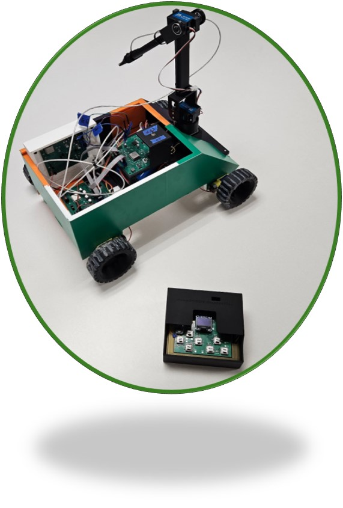

Exploration Device Project: 
CropSCOUT  
**Team 202**  
*S.C.O.U.T.S*  
*Super Cool Original and Unique Technology Systems*    
**Submission: May 4, 2026** 
Spring - 2026 
Arizona State University 
**EGR 314** 
Dr. Nichols 
  

## Team Introduction
S.C.O.U.T.S (Super Cool Original and Unique Technology Systems) is a group of engineering students who share a goal of designing a reliable and easy-to-use exploration rover tasked to sense surroundings for agricultural use. Each member supports a unique aspect of the rover model, enabling wireless control and the relay of various sensing data. The data projects the surrounding soil temperature, humidity, and pressure, and is equipped with a tilt sensor and a metal detector. Through communication and creativity, we strive to develop a reliable exploration device that enables users to observe and interact safely with challenging environments. 

## Project Summary
We constructed CropSCOUT, a land exploration rover designed to survey large or dangerous regions. The CropSCOUT is equipped with a 4-wheel drive, a controllable front arm, temperature, humidity, metal, and accelerometer sensors. The CropSCOUT is also accompanied by a controller that features a directional pad, an OLED screen, and the ability to communicate wirelessly with the rover via MQTT. The CropSCOUT is powered by a 12V battery attached to the arm and shared among all sections of the rover. The CropSCOUT aims to assist in treating and mapping areas that may be dangerous or taxing for a person to survey manually. We spent the semester each building modular subsystems to create a prototype for display at the Innovation Showcase. The CropSCOUT's final assembly incorporated 5 of 7 working subsystems, omitting the accelerometer and metal-detection subsystems. You can view the final prototype in **Figure 1** and **Video 1**, as well as on this website, to see our team's engineering process for creating this project. You can also view an individual level by using the links to the subsystem datasheets below.

## Figure 1: Final Project Picture

## Video 1: Full Showcase Video Demo
<iframe width="560" height="315" src="https://www.youtube.com/embed/CgNYh9vksoY?si=5lFRXKqbXAz6XXHL" title="YouTube video player" frameborder="0" allow="accelerometer; autoplay; clipboard-write; encrypted-media; gyroscope; picture-in-picture; web-share" referrerpolicy="strict-origin-when-cross-origin" allowfullscreen></iframe>

## Team Members Datasheet links

| **Team Member**        |**Ind Datasheet Links** |
| ---------------------- | -----------------------|
| Jacob Alger            | [Jacob-Alger.Github](https://jacob-alger.github.io/Jacob-Alger-314.github.io/) |
| Caleb Yuen             | [Caleb-Yuen.Github](https://cyuen808.github.io/cyuen808.EGR314.github.io/) |
| Aaron Kiem             | [Aaron-Kiem.Github](https://aaronkiem.github.io/) |
| Isaiah Johnston        | [Isaiah-Johnston.Github](https://isaiahcmd.github.io/Isaiahcmd-EGR314.github.io/) |
| Cristopher Gutierrez   | [Cristopher-Gutierrez.Github](https://cgutie40.github.io/cgutie40-EGR314.github.io/)|
| Asadbek Ruziev         | [Asadbek-Ruziev.Github](https://mraruziev.github.io/Asadbek-EGR314/)|
| Tyler Dean             | [Tyler-Dean.Github](https://ty-357.github.io//)|

## Page Index
The links below provide a mobile-friendly method for navigating the CropSCOUT data sheet.

| **Page Links**        |
| ---------------------- | 
| [Team Organization](https://egr314-s-2026-202.github.io/01-Organization/Team-Organization/) |
| [Concept Design](https://egr314-s-2026-202.github.io/02-Concept-Design/Design/) |
| [Project Requirements](https://egr314-s-2026-202.github.io/03-Project-Requirements/Project-requirements/) |
| [Team Block Diagram](https://egr314-s-2026-202.github.io/04-Team-Block-Diagram/Team-Diagram/) |
| [Design Review Video](https://egr314-s-2026-202.github.io/05-Design-Review/design-review/) |
| [Prototype](https://egr314-s-2026-202.github.io/06-Prototype/Showcase/) |
| [Project Version 2.0](https://egr314-s-2026-202.github.io/07-Project-Version-2-0/Project-Version-2-0/) |
| [Resources](https://egr314-s-2026-202.github.io/08-Resources/Resources/) |
